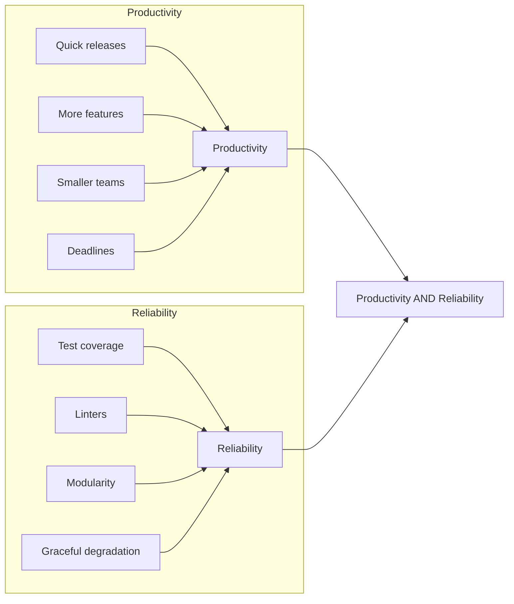
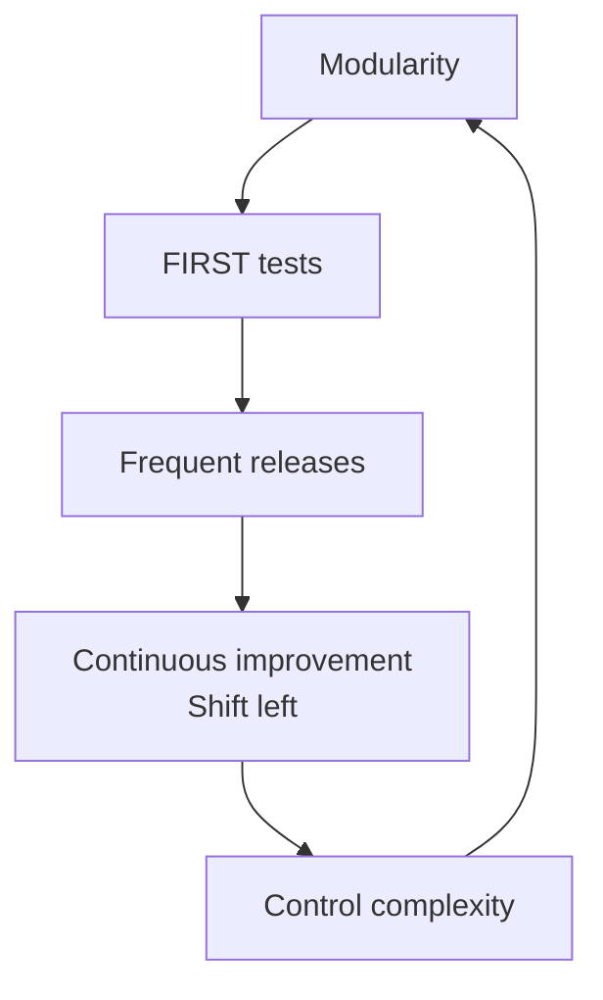

# Course transcripts

This page covers the concepts covered in the exercises

## Purpose

Build habits for productivity and reliability.

## Cycle of value

The cycle of value is a cycle of writing code, testing it, and then refactoring it to improve its quality.
This cycle keeps the code healthy and easy to maintain.
It's like brushing your teeth - do it every day to keep your teeth healthy.

## Ecosystem

| Purpose        | Recommendation          |
| -------------- | ----------------------- |
| JDK            | Eclipse Temurin OpenJDK |
| Language level | Java 21 or 25           |
| Build tool     | Maven or Gradle         |
| Framework      | Spring Boot             |
| Testing        | JUnit 5 + Mockito       |
| Packaging      | Docker                  |
| Deployment     | Kubernetes              |
| IDE            | VS Code, Eclipse        |

## Modularity

Modularity is the practice of breaking down code into smaller pieces. This makes it easier to understand, test, and maintain.

However, cutting code arbitrarily can lead to confusion. [Naming by purpose](naming.md) is the easiest way to validate if you're on the right path. Explore this, and more ways to reduce cognitive load.